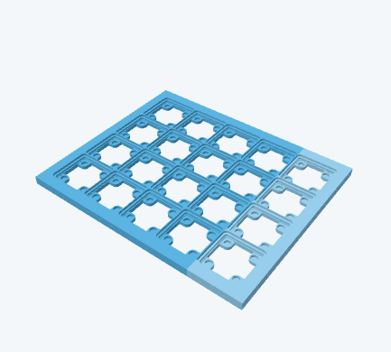
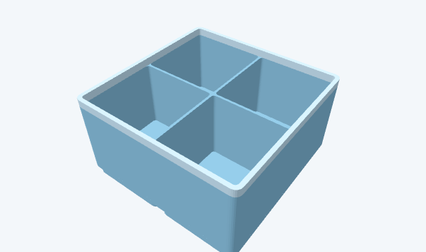
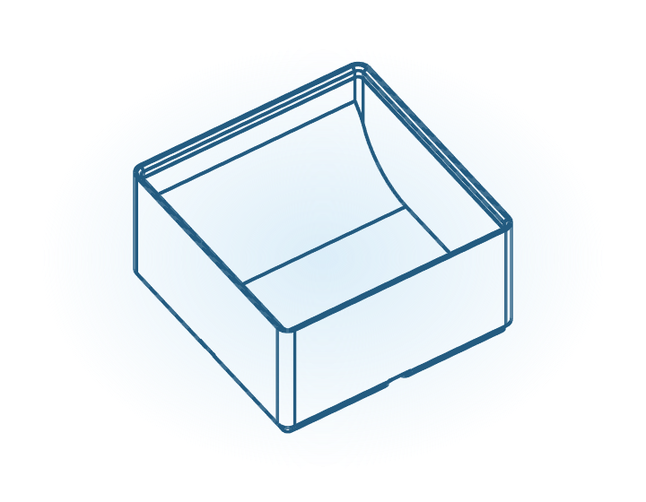
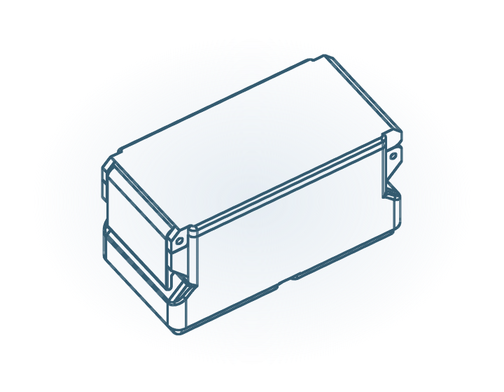
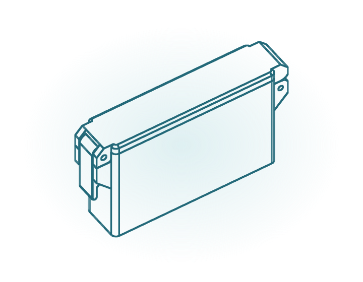
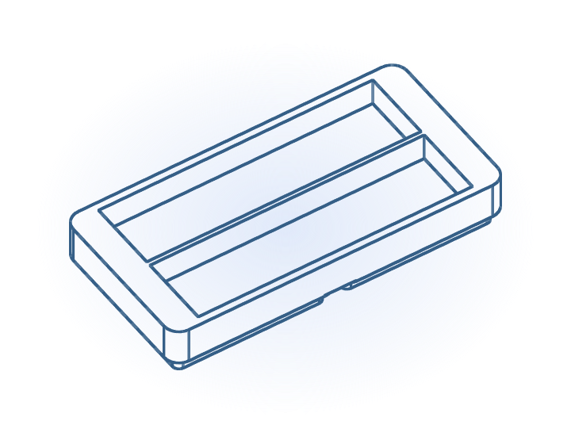
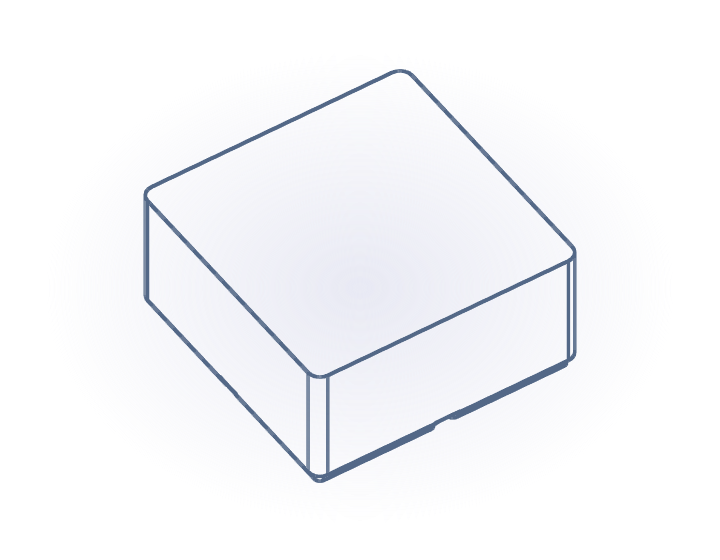
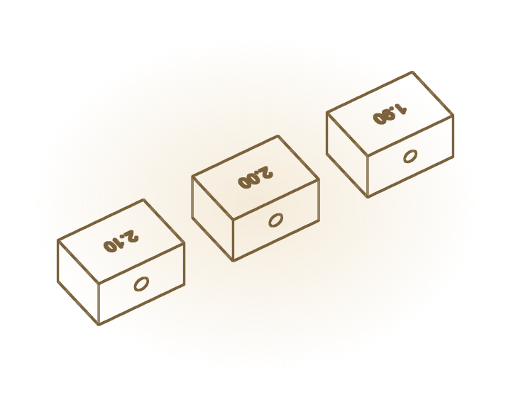
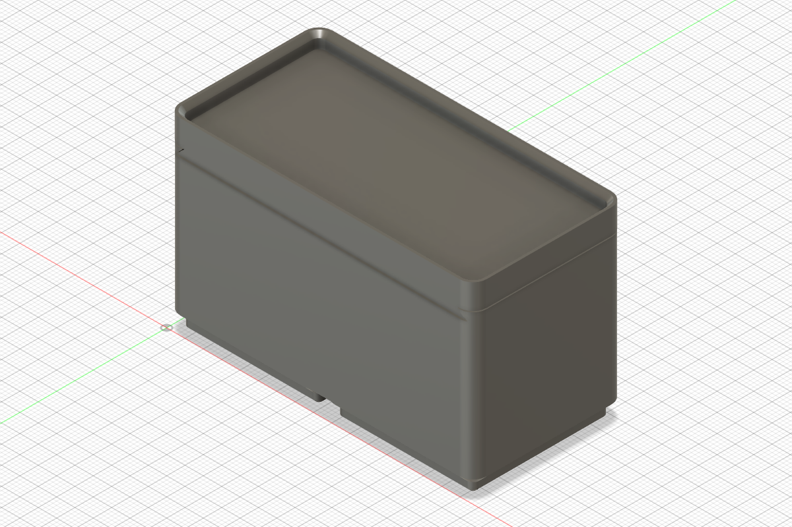

# Gridfinity Workshop

An Autodesk Fusion add-in for drawer-fit baseplates, everyday bins, clasp storage and matching cartridge magazines. Configure a layout with a live 3D preview, then create named Fusion bodies ready to inspect and export for printing.

This is a continuation of [FusionGridfinityGenerator by Lev Mishin](https://github.com/Le0Michine/FusionGridfinityGenerator), with a new workshop interface and generation workflow. Grid-based parts use the standard **42 mm pitch and 7 mm height units**, with bins and individual printed plates up to **6 × 6 cells**; larger drawers are tiled automatically.

## A look at the workshop

These are fresh captures of the integrated add-in's live preview canvases in Fusion. Previews update locally as settings change; Fusion geometry is created only when you press Create.

| Drawer-fit baseplate | Standard divided bin |
| --- | --- |
|  |  |

The bin catalog uses illustrations derived from actual generated models:

| Standard bin | Clasp bin | Cartridge |
| --- | --- | --- |
|  |  |  |
| Cartridge magazine | Custom blank | Fit tests |
|  |  |  |



*Actual Fusion geometry: a standard bin with a separate sliding dovetail lid. The lid plate is fixed at 3 mm; a stacking lip above the dovetail is optional.*

## What you can create

- **Baseplates:** fit a drawer or choose a grid size, position the padding, choose solid or skeletonized cells, and split the layout into printable pieces for your bed. Optional magnet pockets and screw holes.
- **Standard bins:** open storage, divided compartments or magnet channels; stacking rim and optional sliding dovetail lid. Lid retention can be none, bump-and-recess, magnets, or both.
- **Clasp bins:** grid-sized bodies with matched lids and pull-tab buckles. Adjustable hinge-pin allowance and buckle clearance; minimum height 6U.
- **Cartridges:** narrow clasp enclosures with open, divided or magnet-channel interiors. Adjustable length and width; minimum height 4U.
- **Cartridge magazines:** grid-based carriers matched to your cartridge dimensions, quantity and orientation. Adjustable slot clearance and optional buckle-access cutouts.
- **Custom blanks:** solid stock or an open envelope built on the standard base for your own modeling.
- **Fit tests:** small pin, closure, magnet, channel-spacing and envelope samples before committing to a full print.

Round, square and rectangular magnet channels support explicit counts and separation in both directions. Over-capacity layouts are rejected. Base magnet pockets offer **6.08 mm press fit**, 6.5 mm clearance fit and custom sizing where supported. Dovetail lid magnets use four 3 x 2 mm or 6 x 2 mm discs in opposed pairs, with separate press/clearance fit controls. Two rear ledges reserve some interior space; channel layouts that overlap them are rejected. The detent has adjustable 0.05-0.20 mm interference and a relieved runout, so the lid remains removable. Test-print retention for your material before a full set.

Saved favorites and fit profiles stay in the embedded browser's local storage.

The preview supports orbit, zoom, fit-to-view, lid visibility and 2D/parts views. It is planning geometry: feet, stacking interfaces and closures are simplified. **Finger scoops and label ledges are currently preview-only**; selecting them disables creation until they are turned off.

## Install and start

1. Obtain the source or a packaged release. For a source checkout:

   ```sh
   git clone https://github.com/iluvmemes/GridfinityWorkshop.git
   ```

   For a release ZIP, extract it once. The included `GridfinityWorkshop` folder is the add-in folder. If using GitHub's **Code → Download ZIP**, rename the extracted folder to `GridfinityWorkshop`.
2. In Fusion, open **Utilities → Add-Ins → Scripts and Add-Ins** (Shift+S), select **Add-Ins**, and add the `GridfinityWorkshop` folder. It must contain both `GridfinityWorkshop.py` and `GridfinityWorkshop.manifest`, plus the `workshop` directory.
3. Select **GridfinityWorkshop**, click **Run**, and enable **Run on Startup** if desired.
4. Open a design. In **Design → Solid → Create**, choose **Gridfinity Baseplates** or **Gridfinity Bins**.

Startup registers the buttons without opening a palette. No separate Python installation, npm installation or network connection is needed for the preview; Three.js and model presets ship with the add-in. Native integration has been checked on Windows; macOS is declared supported by the manifest but has not been verified in this release.

**Upgrading from the experimental UI:** stop and disable `GridfinityUIPreview` in Scripts and Add-Ins, then register the repository root as above. The old prototype launcher is retired. The main add-in now opens the workshop instead of the original native dialogs. Existing models are unaffected. Browser-local favorites are not guaranteed to transfer when the install path changes.

## Create and print

Choose a family, enter your dimensions and fit settings, and inspect the preview. Finish any active Fusion command before pressing Create.

Baseplates, standard bins, blanks and magazines are added to the current design through an undoable native command. Clasp bins, cartridges and fit tests open a new design. Generation scopes cuts to the new parts; bodies and sketches receive descriptive layout names. Inspect the generated bodies, then use Fusion's mesh export for your slicer. Save your design normally if you want to keep the editable model.

## Update

Stop the add-in before replacing files. Extract a new release into a clean `GridfinityWorkshop` folder at the same location, or update your source checkout, then restart Fusion or run the add-in again. Keep local work before replacing a checkout. Avoid mixing files from different release versions.

## Development and packaging

`GridfinityWorkshop.py` is the main Fusion entry point. `workshop/` contains runtime code, UI assets, offline Three.js and cached standard interfaces. Reusable tests and Fusion checks live in `.agents/qa/`; asset and preset maintenance tools live in `scripts/assets/`. `lib/` and `config.py` retain the original geometry dependencies used to rebuild bin presets; they are not started or included in the Workshop release. Retired experiments and command UI are available in Git history.

From the repository root, with Python and Node.js installed:

```sh
python .agents/qa/run-unit.py .agents/qa/runs/local
python .agents/qa/test-release.py
python scripts/build-release.py
```

The builder writes `dist/GridfinityWorkshop-v2.0.0.zip`, with a single correctly named install folder and all runtime assets. It excludes experiments, QA evidence and generated exports. The release workflow uses the same builder and checks. Pushing a `v*` tag attaches the archive to a prerelease; manual workflow runs provide a downloadable build artifact.

Reusable Fusion E2E plans, runners and evidence are in [.agents/qa](.agents/qa/README.md). Integration checks cover startup, palette resources, actual Create-button paths and document cleanup. Preview captures above are planning views, not dimensional manufacturing references.

## Credits and license

- Original Fusion generator: [Lev Mishin](https://github.com/Le0Michine/FusionGridfinityGenerator). Support the original author via [Buy Me a Coffee](https://www.buymeacoffee.com/levmishin) or [Patreon](https://www.patreon.com/levmishin).
- Gridfinity: [Zack Freedman](https://www.youtube.com/watch?v=ra_9zU-mnl8).
- Three.js: bundled under its [MIT license](workshop/vendor/three-LICENSE.txt); [version and source](workshop/vendor/README.txt).

Gridfinity Workshop continues under [Creative Commons Attribution-NonCommercial-ShareAlike 4.0](LICENSE.md), retaining the original project's attribution and license.

Baseplate drawer layouts accept dimensions up to 2500 mm per axis (or grids up to 60 cells per axis). Each printed piece remains limited to 6×6 cells and the selected print bed; padding is applied only at the outer drawer edges. Bin sizes remain limited to 6×6.
